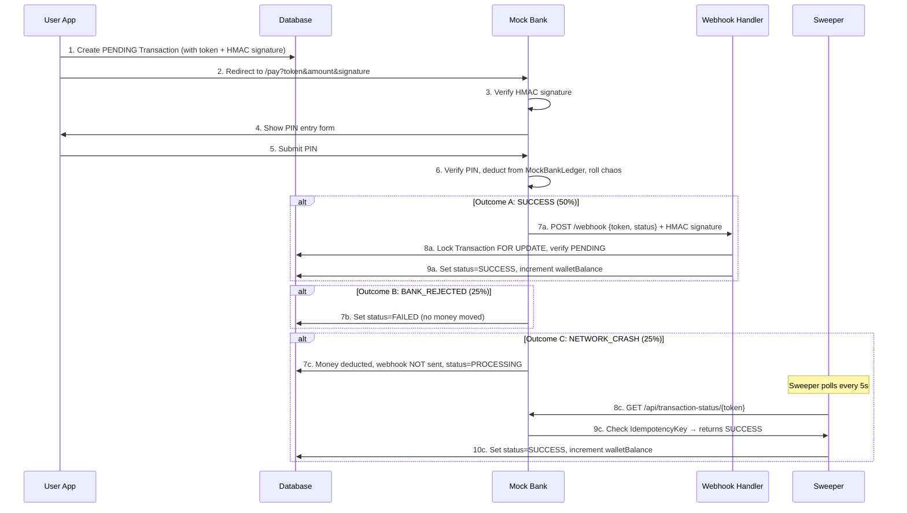
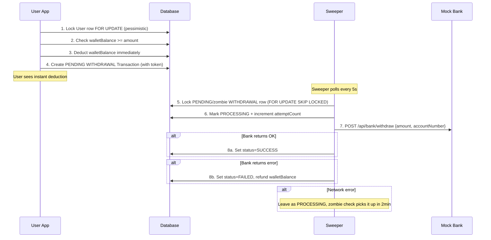

# Wallet App — Architecture Walkthrough

## Monorepo Structure (Turborepo + npm workspaces)

```
wallet-app/
├── apps/
│   ├── user-app       (Next.js :3000) — Main wallet UI
│   ├── mock-bank      (Next.js :3001) — Simulated external bank
│   ├── webhook-handler (Express :3002) — Processes bank→wallet webhooks
│   └── sweeper        (Node.js worker) — Background reconciliation poller
├── packages/
│   ├── db             — Prisma schema, client, seed, constraints
│   ├── ui             — (Placeholder for shared components)
│   ├── eslint-config  — Shared ESLint config
│   └── typescript-config — Shared TSConfig
```

All four apps run concurrently via `npm run dev` (uses `concurrently`).

---

## Database (PostgreSQL via Neon + Prisma)

### Key Models

| Model | Purpose |
|---|---|
| **User** | `id`, `email`, `phone`, `name`, `passwordHash`, `walletBalance` (in paise) |
| **BankAccount** | Linked bank accounts per user (`accountNo`, `last4`, `bankName`, `isPrimary`) |
| **Transaction** | All money movements — `type` (DEPOSIT/WITHDRAWAL/TRANSFER), `status` (PENDING→PROCESSING→SUCCESS/FAILED), `token`, `amount` (paise), `senderId`, `receiverId`, `bankAccountId` |
| **IdempotencyKey** | Bank-side dedup: records that money was deducted from the bank ledger |
| **MockBankLedger** | The bank's own ledger: `accountNumber`, `pinHash`, `bankBalance` |

### Enums
- `TransactionType`: DEPOSIT, WITHDRAWAL, TRANSFER
- `TransactionStatus`: PENDING, PROCESSING, SUCCESS, FAILED

### Database Constraints
Applied via [apply-constraints.ts](file:///c:/Users/KRUTANT/OneDrive/Desktop/Demo/wallet-app/packages/db/src/apply-constraints.ts):
- `wallet_balance_non_negative` — User.walletBalance >= 0
- `bank_balance_non_negative` — MockBankLedger.bankBalance >= 0

---

## Authentication (NextAuth + Credentials)

- [auth.ts](file:///c:/Users/KRUTANT/OneDrive/Desktop/Demo/wallet-app/apps/user-app/auth.ts) — JWT-based sessions with email/password login via `CredentialsProvider`
- [proxy.ts](file:///c:/Users/KRUTANT/OneDrive/Desktop/Demo/wallet-app/apps/user-app/proxy.ts) — Middleware that protects all routes except `/`, `/auth/*`
- Session extends `DefaultSession` with `user.id`

---

## Feature: Add Money (DEPOSIT) — ✅ IMPLEMENTED

This is the fully implemented flow with a sophisticated 3-outcome chaos engine:

### Flow Diagram



### Locking Strategy (3-Lock Model)

| Lock | What | How |
|---|---|---|
| **Lock 1** | MockBankLedger row | `SELECT ... FOR UPDATE` — prevents double-deduction |
| **Lock 2** | Transaction row | `SELECT ... FOR UPDATE` — prevents duplicate webhook processing |
| **Lock 3** | User walletBalance | Prisma `{ increment: amount }` — atomic wallet credit |

### Key Files

| File | Role |
|---|---|
| [add-money.ts](file:///c:/Users/KRUTANT/OneDrive/Desktop/Demo/wallet-app/apps/user-app/app/actions/add-money.ts) | Server action: creates PENDING tx, generates HMAC, returns redirect URL |
| [authorize/route.ts](file:///c:/Users/KRUTANT/OneDrive/Desktop/Demo/wallet-app/apps/mock-bank/app/api/authorize/route.ts) | Mock bank: verifies HMAC+PIN, deducts ledger, rolls chaos engine, fires webhook |
| [webhook-handler/index.ts](file:///c:/Users/KRUTANT/OneDrive/Desktop/Demo/wallet-app/apps/webhook-handler/src/index.ts) | Express POST /webhook: verifies HMAC signature, locks tx row, credits wallet |
| [sweeper/index.ts](file:///c:/Users/KRUTANT/OneDrive/Desktop/Demo/wallet-app/apps/sweeper/src/index.ts) | Background poller: `reconcileOrphanedDeposits()` — recovers from network crashes |

---

## Feature: Withdraw Money (WITHDRAWAL) — ⚠️ PARTIALLY IMPLEMENTED

The backend logic is in place but the **mock-bank's `/api/bank/withdraw` endpoint is simplistic** (just deducts balance, no chaos engine).

### Current Flow



### Key Design Decisions

- **Debit-first**: Wallet balance is deducted **immediately** (inside a pessimistic row lock), not after bank confirms. This prevents overdraft race conditions.
- **Sweeper-driven**: Unlike deposits (which are webhook-driven), withdrawals are fully driven by the sweeper polling loop.
- **Refund on failure**: If the bank rejects, the sweeper refunds the user's wallet balance atomically.
- **Zombie recovery**: Transactions stuck in PROCESSING for >2 minutes are re-claimed by the sweeper.

### Key Files

| File | Role |
|---|---|
| [withdraw-money.ts](file:///c:/Users/KRUTANT/OneDrive/Desktop/Demo/wallet-app/apps/user-app/app/actions/withdraw-money.ts) | Server action: locks User, checks balance, deducts, creates PENDING tx |
| [sweeper/index.ts](file:///c:/Users/KRUTANT/OneDrive/Desktop/Demo/wallet-app/apps/sweeper/src/index.ts) | `processWithdrawalQueue()` — picks up PENDING withdrawals, calls bank, finalizes |
| [bank/withdraw/route.ts](file:///c:/Users/KRUTANT/OneDrive/Desktop/Demo/wallet-app/apps/mock-bank/app/api/bank/withdraw/route.ts) | Simple bank endpoint: deducts from MockBankLedger |

### What's Missing / Needs Work

> [!IMPORTANT]
> The withdraw feature has **backend logic and UI forms** already built, but the mock-bank's withdraw endpoint is very simplistic compared to the deposit flow:
> - No chaos engine (no BANK_REJECTED / NETWORK_CRASH simulation)
> - The sweeper passes `bankAccountId` instead of `accountNo` to the bank
> - No HMAC signature verification on the bank's withdraw endpoint
> - No idempotency protection

---

## Feature: P2P Transfer — ❌ NOT YET IMPLEMENTED

The sidebar has a "Send Money" link to `/dashboard/send-money`, but no page or action exists yet.

---

## UI Architecture (user-app)

- **Framework**: Next.js (App Router) with Tailwind CSS + shadcn/ui components
- **Theme**: Dark mode (`bg-[#080810]`), violet/emerald accents, glassmorphism
- **Layout**: Fixed sidebar (desktop) + top navbar with session info
- **Pages**:
  - `/dashboard` — Balance card + 5 recent transactions
  - `/dashboard/add-money` — Amount input, bank selector, redirects to mock-bank
  - `/dashboard/withdraw` — Amount input (with balance validation), bank selector
  - `/dashboard/transactions` — Paginated (cursor-based) full transaction history

---

## Service Ports

| Service | Port | Tech |
|---|---|---|
| user-app | 3000 | Next.js |
| mock-bank | 3001 | Next.js |
| webhook-handler | 3002 | Express |
| sweeper | — | Node.js (no HTTP server, just setInterval poller) |

---

## Security Model

| Mechanism | Where Used |
|---|---|
| **HMAC-SHA256** | user-app → mock-bank (token+amount signed), mock-bank → webhook-handler (token+status signed) |
| **Pessimistic row locks** | `SELECT ... FOR UPDATE` on User, Transaction, MockBankLedger |
| **`FOR UPDATE SKIP LOCKED`** | Sweeper uses this to prevent multiple sweeper instances from processing the same row |
| **DB CHECK constraints** | `walletBalance >= 0`, `bankBalance >= 0` — last line of defense against negative balances |
| **IdempotencyKey table** | Bank records successful deductions; sweeper checks this for reconciliation |
| **Bearer token auth** | Sweeper → mock-bank `/api/transaction-status/` endpoint |
